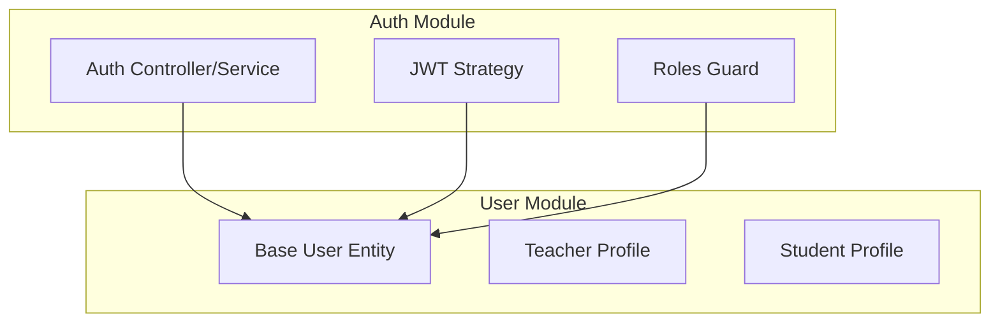
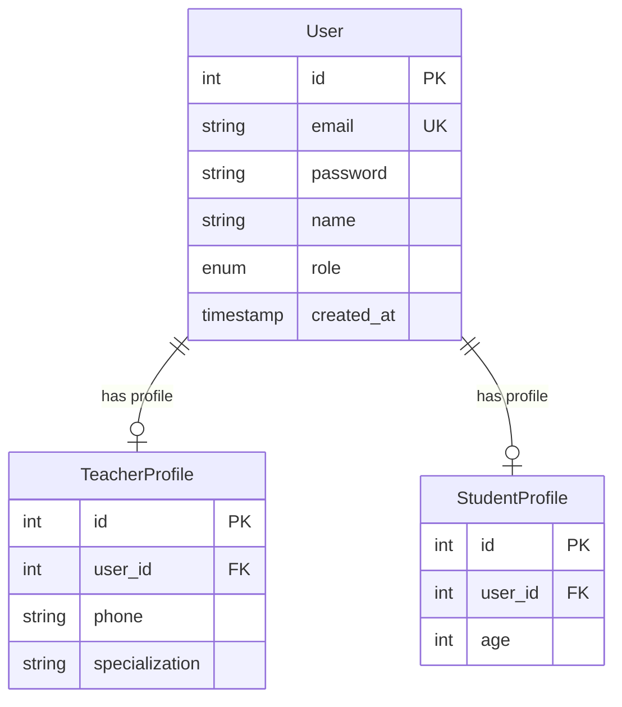

# Plan: Merge User Entities & Implement JWT Authentication

## Project Overview

- **Objective**: Merge `student` and `teacher` entities into a unified `user` folder and implement JWT-based authentication with role-based access control
- **Target**: Integrate login system to distinguish between `student` and `teacher` roles

---

## Architecture Design

### New Structure

### Database Schema

---

## Implementation Steps

### Phase 1: Install Dependencies

- [ ] Install `@nestjs/jwt` for JWT token generation
- [ ] Install `@nestjs/passport` and `passport` for authentication
- [ ] Install `passport-jwt` for JWT strategy
- [ ] Install `passport-local` for local authentication
- [ ] Install `bcrypt` for password hashing
- [ ] Install `class-transformer` for DTO serialization

### Phase 2: Create User Module Structure

- [ ] Create `backend/src/users/` directory
- [ ] Create `users/entities/user.entity.ts` - Base user entity with:
  - `id`, `email`, `password`, `name`, `role` (enum: STUDENT, TEACHER)
- [ ] Create `users/entities/teacher-profile.entity.ts` - Teacher-specific fields
- [ ] Create `users/entities/student-profile.entity.ts` - Student-specific fields
- [ ] Create `users/dto/create-user.dto.ts` - DTO for user creation
- [ ] Create `users/dto/login.dto.ts` - DTO for login
- [ ] Create `users/users.service.ts` - User service
- [ ] Create `users/users.controller.ts` - User controller
- [ ] Create `users/users.module.ts` - User module

### Phase 3: Implement Authentication Module

- [ ] Create `backend/src/auth/` directory
- [ ] Create `auth/auth.service.ts` - Authentication service:
  - `validateUser()` - Verify email/password
  - `login()` - Generate JWT token
  - `register()` - Create new user
- [ ] Create `auth/auth.controller.ts` - Auth controller:
  - POST `/auth/login` - Login endpoint
  - POST `/auth/register/student` - Register student
  - POST `/auth/register/teacher` - Register teacher
- [ ] Create `auth/jwt.strategy.ts` - JWT passport strategy
- [ ] Create `auth/auth.module.ts` - Auth module

### Phase 4: Implement Role-Based Access Control

- [ ] Create `common/guards/roles.guard.ts` - Roles guard
- [ ] Create `common/decorators/roles.decorator.ts` - @Roles() decorator
- [ ] Apply `@Roles()` decorator to existing endpoints

### Phase 5: Refactor Course Entity

- [ ] Update `courses/entities/course.entity.ts`:
  - Change `teacher` relation to use new User entity
  - Add `teacherId` field

### Phase 6: Update App Module

- [ ] Update `app.module.ts`:
  - Add AuthModule to imports
  - Add UserModule to imports
  - Update entities array

### Phase 7: Testing & Validation

- [ ] Test login with student credentials
- [ ] Test login with teacher credentials
- [ ] Test role-based access (student cannot access teacher endpoints)
- [ ] Verify JWT token is returned on successful login

---

## API Endpoints (New/Updated)

### Authentication

| Method | Endpoint                 | Description               | Access |
| ------ | ------------------------ | ------------------------- | ------ |
| POST   | `/auth/login`            | Login with email/password | Public |
| POST   | `/auth/register/student` | Register new student      | Public |
| POST   | `/auth/register/teacher` | Register new teacher      | Public |

### Users

| Method | Endpoint         | Description                 | Access |
| ------ | ---------------- | --------------------------- | ------ |
| GET    | `/users/profile` | Get current user profile    | Auth   |
| PUT    | `/users/profile` | Update current user profile | Auth   |

---

## Notes

- Passwords will be hashed using bcrypt
- JWT tokens will contain user id, email, and role
- Token expiration: 7 days (configurable)
- Student and Teacher data will be separate profile entities linked to User
